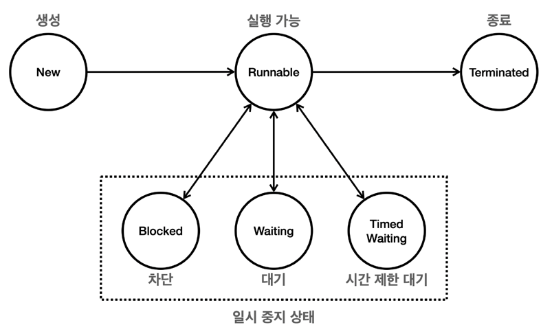

# chapter03. 스레드 제어(join)와 생명주기

## 1. 스레드 기본정보 ([ThreadInformationMain](./ThreadInformationMain.java))
1. 스레드 ID - 스레드의 고유 식별자 (JVM내에서 각 스레드에 대해 유일값, 직접지정 불가)
2. 스레드 이름 - 스레드이름 (중복가능)
3. 스레드 우선순위 - 1~10, 기본값 5, 우선순위를 높게하면 CPU자원을 더 많이 할당받으나, 실제적으로는 CPU의 스레드 스케쥴링에 따라 결정된다.
4. 스레드 그룹 - 스레드를 그룹화하여 관리할 수 있는 기능 제공
5. 스레드 상태 - `getState()`메소드로 확인가능
   1. NEW
   2. RUNNABLE
   3. BLOCKED
   4. WAITING
   5. TIMED_WAITING
   6. TERMINATED

## 2. 스레드 생명주기 ([ThreadLifeCycleMain](./ThreadLifeCycleMain.java))
  
### 2.1 스레드 상태 
1. NEW : 스레드 객체가 생성되었지만, `start()`메소드가 호출되지 않은 상태
2. RUNNABLE : `start()`메소드가 호출되어 스레드가 실행준비가 된 상태
- CPU 스케쥴러의 실행대기 상태 or 실행 상태 : JAVA에서는 구분불가
- 보통 `실행상태`라고 함
3. BLOCKED : 스레드가 동기화 블록에 의해 일시정지된 상태
- 예를 들어 `synchronized` 블록에 진입하기 위해 락을 얻어야하는 경우 이 상태에 들어감
4. WAITING : 스레드가 다른 스레드가 통지할 때까지 무기한 기다리는 상태
- `wait()`, `join()` 메소드 호출로 인해 스레드가 무기한 대기하는 상태
- `notify()`, `notifyAll()` 메소드로 스레드가 통지되어 실행대기 상태로 전환됨
5. TIMED_WAITING : 스레드가 일정시간동안 기다리는 상태
- `sleep()`, `join(long millis)`, `wait(long millis)` 메소드로 인해 스레드가 일정시간동안 대기하는 상태
6. TERMINATED : 스레드가 실행을 마친 상태
- 스레드는 한번 실행이 종료되면 다시 실행할 수 없음
### 2.2. JAVA 스레드의 상태 전이 과정
1. NEW -> RUNNABLE : `start()`메소드 호출
2. RUNNABLE -> BLOCKED / WAITING / TIMED WAITING : 스레드가 락을 얻지 못했거나, wait(),sleep()메소드를 호출할 때 해당 상태로 전이
3. BLOCKED / WAITING / TIMED WAITING -> RUNNABLE : 락을 얻거나, wait(),sleep()메소드가 종료되면 RUNNABLE상태로 전이
4. RUNNABLE -> TERMINATED : 스레드가 실행을 마치면 TERMINATED상태로 전이

## 3. Join ([ThreadJoinMain](./ThreadJoinMain.java))
- `Thread.run()` 실행시에 해당 스레드의 종료시점을 부모쓰레드에서는 알 수 있는 방법이 없다. 그러나 join()메소드를 사용하면 해당 스레드가 종료될 때까지 대기(`WAITING` 상태)할 수 있다.
- `join()`메소드는 호출한 스레드가 종료될 때까지 대기하는 메소드
- `join(long millis)`메소드는 호출한 스레드가 종료될 때까지 대기하는 메소드로, 일정시간동안 대기하다가 시간이 지나면 실행대기상태로 전환됨