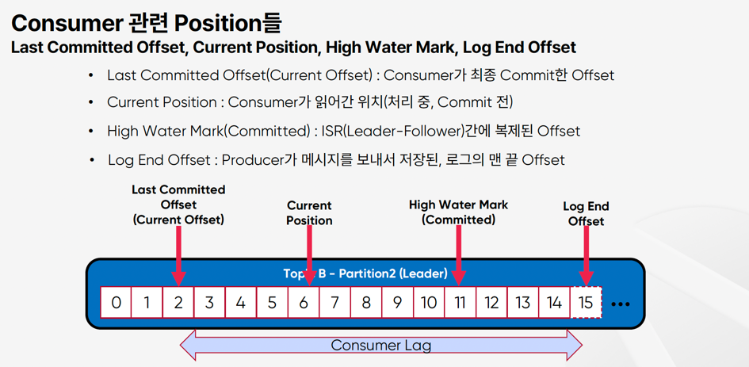

### 카프카 특징
- 데이터 스트림을 안전하게 전송 (Publish & Subscribe)
- 데이터 스트림을 디스크에 저장 (Write To Disk)
- 데이터 스트림을 분석 (Processing & Analysis)

### 카프카 유즈케이스
- Event(메시지/데이터)가 사용되는 모든 곳에서 사용
  - Legacy Messaging 대체
  - IOT 디바이스 혹은 애플리케이션으로 부터 데이터 전송
  - 시스템 혹은 애플리케이션에서 발생하는 로그 수집 및 전송
  - Realtime Data Stream Processing
  - 실시간 ETL(Extract, Transform, Load)

### Topic, Partition, Segment 특징
- Topic 생성시 Partition 개수를 지정 (개수 변경 가능하나 운영시에는 변경 권장하지 않음)
- Partition 번호는 0 부터 시작하고 오름차순
- Topic 내의 Partition 들은 서로 독립적임
- Event(Message)의 위치를 나타내는 offset 이 존재
- Offset은 하나의 Partition에서만 의미를 가짐 (Partition 0 의 offset 1 ≠ Partition 1 의 offset 1)
- Event(Message) 의 순서는 하나의 Partition내에서만 보장
- Offset 값은 계속 증가하고 0 으로 돌아가지 않음
- Partition 에 저장된 데이터(Message)는 변경이 불가능(Immutable)
- Partition 에 Write되는 데이터는 맨 끝에 추가되어 저장됨
- Partition은 Segment File들로 구성됨(Rolling 정책 : log.segment.bytes(default 1 GB), log.roll.hours(default 168 hours))

### `Zookeeper`와 `Broker`는 다르다.  
- Broker는 Partition에 대한 Read 및 Write를 관리하는 소프트웨어
- Broker는 Topic 내의 Partition 들을 분산, 유지 및 관리
- 최소 3대 이상의 Broker를 하나의 Cluster로 구성해야 함
  - 4대 이상을 권장함(Zookeeper mode에서)
  - Upgrade 등 작업시 Broker를 순차적으로 Shutdown시, 정상동작을 위함
  - Zookeeper mode가 아닌 KRaft mode 에서는 3대 이상 권장
- Zookeeper는 Broker/Topic/Partition 들의 목록/설정/상태 등을 관리하는 소프트웨어
- Zookeeper는 홀수의 서버로 작동하게 설계되어 있음 (최소 3, 권장 5)
- Zookeeper를 사용하지 않는 KRaft mode의 Kafka는 AK 3.3 부터 “production-ready”

### Producer
- Message == Record == Event == Data
- Message는 Header 와 Key 그리고 Value 로 구성
- Kafka는 Record(데이터)를 Byte Array로 저장
- Producer는 Serializer, Consumer는 Deserializer를 사용
- Producer는 Message의 Key 존재 여부에 따라서 Partitioner를 통한 메시지 처리 방식이 다름

### Consumer
- Consumer는 각각 고유의 속도로 Commit Log로부터 순서대로 Read(Poll)를 수행
- Consumer Offset : Consumer가 자동이나 수동으로 데이터를 읽은 위치를 commit하여 다시 읽음을 방지
  - `__consumer_offsets` 라는 Internal Topic에서 Consumer Offset을 저장하여 관리
- 동일한 group.id 로 구성된 모든 Consumer들은 하나의 Consumer Group을 형성
- 다른 Consumer Group의 Consumer들은 분리되어 독립적으로 작동
- 동일한 Key를 가진 메시지는 동일한 Partition에만 전달되어 Key 레벨의 순서 보장 가능
- Key 선택이 잘 못되면 작업 부하가 고르지 않을 수 있음
- Consumer Group 내의 다른 Consumer가 실패한 Consumer를 대신하여 Partition에서 데이터를 가져와서 처리함

### Replication
- Partition을 복제(Replication)하여 다른 Broker상에서 복제물(Replicas)을 만들어서 장애를 미리 대비함
- Replicas - Leader Partition, Follower Partition
- Producer는 Leader에만 Write하고 Consumer는 Leader로부터만 Read함
- Follower는 Leader의 Commit Log에서 데이터를 가져오기 요청(Fetch Request)으로 복제
- 복제본(Replica-Leader/Follower)은 최대한 Rack 간에 균형을 유지하여 Rack 장애 대비하는 Rack Awareness 기능이 있음

### In-Sync Replicas
- ISR은 현재 리더 파티션과 동기화 상태인 팔로워 복제본들의 리스트. 즉, 리더와 같은 데이터를 가지고 있거나 최신 데이터를 거의 즉시 반영할 수 있는 복제본들. 이 리스트에 포함된 팔워만이 리더가 장애가 발생했을 때, 새로운 리더로 승격될 자격이 있다.
  - ISR은 `High Water Makr`라고 하는 지점까지 동일한 Replicas(Leader, Follower모두)의 목록  

