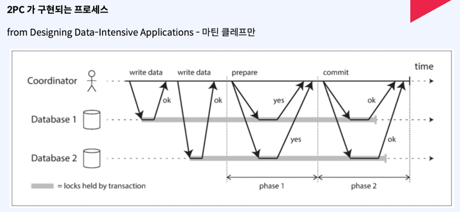
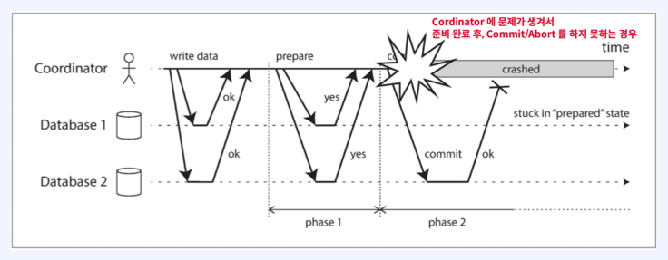
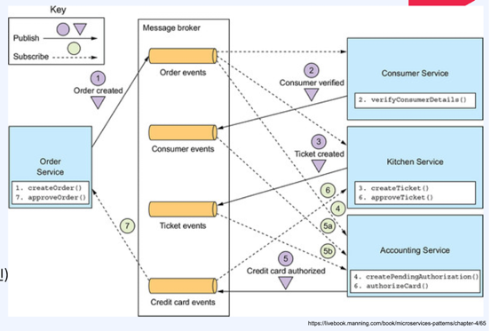
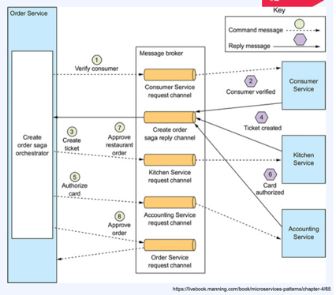
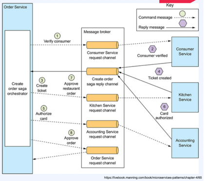
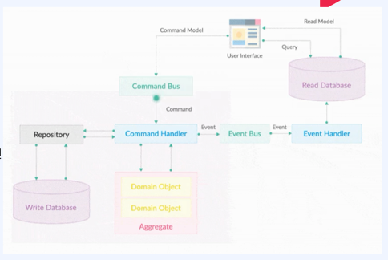

# MSA
- 도메인을 분리하여
- 커다란 시스템을 여러 개의 작은 시스템으로 나누어 개발하는 방법론
- 각 시스템은 분리되어 관리되므로 아래와 같은 장점이 있음.
  - 각 시스템은 독립적으로 개발, 배포, 운영됨
  - 각 시스템은 서로 통신하여 동작함
  - 각 시스템은 서로 다른 기술 스택을 사용할 수 있음
  - 각 시스템은 서로 다른 데이터베이스를 사용할 수 있음
  - 각 시스템은 서로 다른 프로그래밍 언어를 사용할 수 있음
  - 각 시스템은 서로 다른 운영체제를 사용할 수 있음
  - 각 시스템은 서로 다른 클라우드 환경을 사용할 수 있음
  - 각 시스템은 서로 다른 팀이 개발, 운영할 수 있음
  - 각 시스템은 서로 다른 배포 주기를 가질 수 있음
  - 각 시스템은 서로 다른 확장성을 가질 수 있음
  - 각 시스템은 서로 다른 가용성을 가질 수 있음
  - 각 시스템은 서로 다른 보안 수준을 가질 수 있음
  - 각 시스템은 서로 다른 비즈니스 요구사항을 가질 수 있음
  - 각 시스템은 서로 다른 비즈니스 모델을 가질 수 있음
- 분해로 인하여 각 시스템은 통신시에 트랜잭션이 요구된다.
  

# MSA의 트랜잭션
- 트랜잭션을 사용하지 않는 이유 (기술적으로 어렵다. 관리포인트가 늘어난다. MSA의 목적에 주객이 전도 될 수도 있다.)
  - 트랜잭션은 분산환경에서 복잡하다.
  - 트랜잭션은 성능에 영향을 줄 수 있다.
  - 트랜잭션은 확장성에 영향을 줄 수 있다.
  - 트랜잭션은 가용성에 영향을 줄 수 있다.
  - 트랜잭션은 보안에 영향을 줄 수 있다.
  - 트랜잭션은 비즈니스 요구사항에 영향을 줄 수 있다.
  - 트랜잭션은 비즈니스 모델에 영향을 줄 수 있다.
- 분산트랜잭션을 사용하지 않고 단순한 기교로 트랜잭션을 구현하는 경우
  - 트랜잭션의 atomic 속성을 분리해도 비즈니스에 영향이 크지 않은 경우에는 고려해 볼 수 있다. but 비즈니스에 영향도가 크다면 반드시 구현해야 한다.
- 단순한 기교로 인해 트랜잭션과 유사하게 진행 할 수도 있다.
  - 재시도(DeadLetterQueue)
    - 재시도를 통한 트랜잭션 상황을 극복하려 할때 주의점
      - 시스템이 "부하"를 받는 상황은 아닌지?
      - 일시적인 문제일 가능성은 아닌지?
      - 장애 지속시간이 어느정도 일지?
      - DLQ(DeadLetterQueue)
        - 여러번 재시도 후에도 실패한 작업이 들어가는 큐를 일컫는다.
        - 짧은 시간내에 재시도 하더라도 괜찮은 비즈니스 인지?
        - 큐잉 인프라가 존재하는지?
        - 모니터링은 수월한지?
  - DB에 상태(Status)를 기록
    - RDB의 특성을 활용하기 때문에 가장 쉬운 구현방법이다.
    - DB 상태 기록을 통한 트랜잭션 구현 주의점
      - RDB에 부하가 없는지?
      - RDB에 충분한 리소스가 존재하는지?
      - DBA SQL튜닝 등 충분한 Plan이 존재하는지? 
- 분산트랜잭션을 구현하는 방법
  - 2PC (Two-Phase Commit)
  - 보상트랜잭션(Compensating Transaction)
  - SAGA 패턴 (2PC + 보상트랜잭션

# 트랜잭션
- ACID
  - Atomicity (원자성)
    - 전체가 수행되거나 혹은 수행되지 않거나의 특성
    - 어느 하나라도 실패하면, 이전에 수행된 변경사항들은 rollback과정이 필요
    - MSA에서는 rollback이 보상트랜잭션
  - Consistency (일관성)
    - 트랜잭션 실행 전과 후에 변경되는 데이터들은 일관성을 유지해야 한다.
    - 도메인, 비즈니스에 따라 약속된 데이터의 변경들만 이뤄져야 한다.
  - Isolation (격리성)
    - 트랜잭션 같에는 서로 영향을 미치지면 안된다.
  - Durability (지속성)
    - 트랜잭션 완료후, 그 결과는 영구적으로 유지되어야 한다.

# 2PC (Two-Phase Commit)
- 분산환경에서의 트랜잭션을 위한 프로토콜
- 2단계 커밋
  - 1단계: 트랜잭션을 준비시키는 단계
  - 2단계: 트랜잭션을 커밋시키는 단계
- 2PC를 위해서는 분산 시스템 환경에서 Cordinator라는 추가적인 요소(인프라)가 필요하다.
- Cordinator(조정자) : 분산트랜잭션을 위해 데이터 변경을 수행하는 서버들의 Phase를 관리한다.
- 트랜잭션을 위한 서비스는 Participant(참여자)라고 부른다.
- 프로세스
  1. (Start Prepare) 트랜잭션이 시작되면 Cordnator가 Global UniqueID(TransationID)를 생성한다.
  2. Cordinator는 사전에 정의된 각 서비스(Participant)에게 Prepare 요청을 보낸다.
  3. 모든 Participant가 준비되었다는 응답을 받는다.(실질적 데이터 변경은 일어나지 않은 상태)
  4. (Prepare done, Commit Start) Cordinator는 모든 Participant에게 Commit 요청을 보낸다.
  5. Participant들은 이전에 준비했던 동작을 마저 진행하고, 각 서비스들은 실제 데이터 변경을 위한 Commit을 진행한다.
  6. 모든 Participant에게 OK응답을 받게 되면 트랜잭션이 완료된다.
  7. (Commit Done)
- 문제점
  - Cordinator에 모든 트랜잭션의 의존성이 존재
    - Cordinator에 문제가 생기는 순간, 모든 트랜잭션은 멈춰버리고 모든 비즈니스가 정지된다.
    - Data Lock
    - 문제가 생기면 결정 주체가 없어진다. (wait or timeout)
  - Cordinator의 모든 결정은 취소가 불가하다.
    - Commit/Abort 결정에 대해서는 그 사이에 어떤 문제가 생겼을지라도 어떤 방법을 써서라도 완료가 되어야 한다-> 데이터 정합성(일관성) 문제
- 정상적인 2PC

- 비정상적인 2PC

  
# 보상트랜잭션(Compensating Transaction)
- 일련의 작업을 보상(보정)하기 위한 트랜잭션을 구현하기 위한 하나의 방법
- "commit"된 데이터를 "commit"되기 이전의 상태로 변경하기 위한 작업
- 데이터베이스의 개념상으로 작업(do)하던 내용을 다시 Undo할 때 "보상(Compensating)"이라는 개념을 사용
- MSA에서의 보상 트랜잭션
  - "commit"된 :: 데이터 변경을 수반하는 요청이 정상적으로 종료된 서비스의  
  - 데이터를 :: API호출에 대해서 
  - "commit"되기 이전의 :: 그 데이터 변경 요청을 하기 이전의 
  - 상태로 변경하기 위한 작업 :: 상태로 되돌리기 위한 API호출
- 문제점
- 보상 트랜잭션 요청에 지연 혹은 실패, 문제가 생기는 경우 보상 트랜잭셔을 호출하는 주체는 명확한 판단이 어렵다.
---
# SAGA 패턴

## 정의
- 이벤트 방식으로 트랜잭션에 포함된 여러 작업(각 서비스의 API Call)읠 결과를 게시하고, 이벤트를 비동기로 처리하여 다음작업들을 진행
  - 모든 실행에 대한 판단은 비동기로 수행되는 큐(메세지 브로커)로 판단하여 관리
- SAGA패턴은 분산 시스템에서 긴 트랜잭션을 관리하는 방법이며, SAG는 일련의 로컬트랜잭션으로 구성되며, 각 로컬 트랜잭션은 다른 로컬 트랜잭션을 트리거 할 수 있다.
- SAGA라는 단어는 무언가의 줄임말이 아니라 Long Lived Transaction을 가르키기는 말로 1987년 논문에서 처음 등장
  - 사전적의미로는 "서사시", "전설", "말로전해져 내려오는..."등을 의미
## 특징
- 2PC -> Cordinator에 문제가 발생하더라도, 제한적으로나마 비즈니스에는 문제를 최소화 시킬수 있어야 한다.
- 보상트랜잭션 -> 지연, 혹은 문제가 발생했을 시 각 서비스가 독립적으로 보상 트랜잭션의 상태를 알 수 있어야 하며, Sync방식으로 무작정 대기하기보다 큐잉(이벤트)을 활용해서 문제시에도 복구하여 처리 가능해야 한다.
- SAGA 패턴의 종류 (기본적으로 2개의 패턴 모두 보상 트랜잭션을 사용)
  - 코레오그래피(Cheoreography) : 각 서비스가 이벤트를 발생시키고, 다음 서비스가 이벤트를 받아 처리하는 방식
    - 독립적인 조율자(Ochestrator)를 두지 않고,Saga를 구현하는 방법
    - 구현이 비교적 간단하지만, 트랜잭션 상황을 모니터링 하기 어렵다
    - 특징
      - 이벤트를 Publish(Produce)하는 작업이 내부 서비스의 트랜잭션과 하나로 묶여야 한다.
      - 만약 하나로 묶이지 않는다면, 내부(각 서비스로컬) 데이터 변경을 위한 작업 이후 정상적으로 이벤트가 발행되지 않을 수 도 있으므로 올바른 패턴 구현이 불가능하다.
      - 각 서비스 입장에서는 사전에 정의된 이벤트만 받고, 정의된 이벤트만 보내면 되기 때문에 구현이 단순하고 복잡도가 낮으나 복잡한 비즈니스가 될 수록 전체적인 트랜잭션의 상태나 Saga의 정의에 대한 분석과 유지보수가 어려워 질 수 있다.
      *정상적인 코레오그래피* 
      *비정상적인 코레오그래피*

  - 오케스트레이션(Orchestration) : 전체 흐름을 제어하는 조율자(Ochestrator)를 두고, 각 서비스가 조율자에게 이벤트를 전달하고, 조율자가 이벤트를 받아 처리하는 방식
    - 조율자가 모든 트랜잭션을 관리하므로, 트랜잭션 상황을 모니터링 하기 쉽다.
    - 조율자가 문제가 생기면, 전체 트랜잭션은 중단된다.
    - 조율자가 문제가 생기면, 보상 트랜잭션을 호출하여 문제를 해결한다.
    - 특징
      - 추가적인 인프라(오케스트레이터)가 필요하기 때문에 이를 관리하기 위한 대책이 동반되어야 한다.
      - 각 서비스에서의 구현은 비교적 간단해지고, 보상 트랜잭션만 구현하면 된다. (관심사 분리로 인한 유지보수 효율성이 높아짐)
      - 트랜잭션에 대한 비즈니스 로직이 오케스트레이터에 포함될 가능성이 있다. (오케스트레이터는 각각의 성공/실패에 대한 처리만 해야하고 비즈니스 로직이 삽입되어서는 안된다.)
        - ex. 각각의 서비스의 응답값에 따른 이벤트 발생 분기 등
    *정상적인 오케스트레이션*
    *비정상적인 오케스트레이션*
  ---
# EDA (Event-Driven Architecture)
- 이벤트소싱을 이용하여 이벤트를 기준으로 모든 데이터의 변경을 처리/조회
- 데이터 영속화 방식
  - 변경이전의 데이터에 대한 정보는 관심이 없음
- 이벤트 드리븐 방식의 특징 : 장애가 발생하거나 서버, 인프라에 문제가 발생할지라도, 앱이 복구되면 메세지브러커(이벤트)에 의존하여 일관성을 구현할 수 있다.
- 단점 : 이벤트가 한번 잘못 발행, 혹은 Consume 이후 잘못된 처리를 하는 순간 모든 데이터 정합성과 트랜잭션이 크게 망가질 수 있음.
---
# EDA를 구현하기 위한 솔루션
- 이벤트 소싱 : 이벤트를 기반으로 모든 데이터의 변경을 처리/조회
- 이벤트 드리븐 : 이벤트를 기반으로 비즈니스 로직을 처리
- EDA는 잘못된 한번의 이벤트 처리가 광장히 큰 여파를 가져올 수 있다. 그러나 아래와 같은 상황에서는 고려 해 볼 가치가 있다.
  - 빈번하게 서버나 DB에서 Sync요청에 대한 실패가 잦은 경우
  - Message Broker를 잘 이해하고 관리할 수 있는 별도의 조직이 있는 경우
  - 각 도메인 데이터의 변경 history가 중요한 비즈니스의 경우
  - Event의 처리 혹은 Message Broker가 실패하더라도, 완벽한 fallback정책이 구현된 경우 

## Eventuate
  - Eventuate Local
    - 이벤트를 기반으로 하나의 서비스(Local)환경에서 EventSourcing 플랫폼 구현을 도와주는 오픈소스
    - Event Driven Domain
  - Eventuate Tram
    - 분산데이터 환경을 도와주는 플랫폼 오픈소스로 Saga, CQRS 패턴 구현을 쉬게 만들어주는 오픈소스
    - EventDriven Platform from Distributed Data Management

## Axon Framework
  - Event Sourcing, CQRS 패턴을 쉽게 구현할 수 있도록 도와주는 오픈소스
  - 태생부터 DDD, CQRS, EDA의 구현을 쉽게하기 위해 개발된 오픈소스 프레임워크
  - 비교적 잘 정리된 문서와 많은 레퍼런스가 존재
  - Axon Framework
    - EventSourcing기반으로 데이터를 관리할 수 있는 도구를 제공하고 이 도구들을 사용해서 CQRS, DDD를 구현할 수 있도록 해준다.
    - SpringBoot 프로젝트에 의존성으로 사용하여, 다양한 어노테이션 기반으로 위 기능을 구현해 볼 수 있다.
    - 구성요소
      - Command Bus : Command(데이터 입력/수정/삭제)만 지나갈 수 있는 통로
      - Command Handler : CommandBus로 부터 받은 Command를 처리할 수 있는 Handler
      - Domain, Aggregate
        - Base on DDD
        - Aggregate :Command를 할 수 있는 도메인 단위
      - Event Bus : Event만 지나갈 수 있는 통로
      - Event Handler : EventBus로 부터 받은 Event를 처리할 수 있는 Handler
    
  - Axon Server 
    - Axon Framework를 사용하여 배포된 어플리케이션들의 조율자(오케스트레이터) 역할
    - Axon Framework를 사용하는 어플리케이션들로부터 발행된 Event들을 저장하는 역할
    - 각 어플리케이션들의 상태를 관리하고, embended된 큐잉을 내재하여 유량조절도 진행한다.
    - 고가용성에 집중된 내부 구현이 있고, Observability를 위한 기능도 제공한다.
  - AxonFramework를 통해 구현하는 SAGA
    - Axon Server 구축 (Axon Framework's Orchestrator)
    - 각 서비스에 Axon Framework 적용(의존성 추가)
    - EventSourcing 방식을 사용해서, 기존의 Request-Response모델을 EventDrivenModel로 변경
    - 변경된 모델을 사용하여 AxonFramework가 지원하는 Saga를 구현 
  