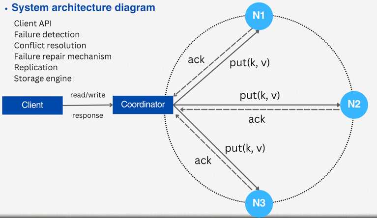
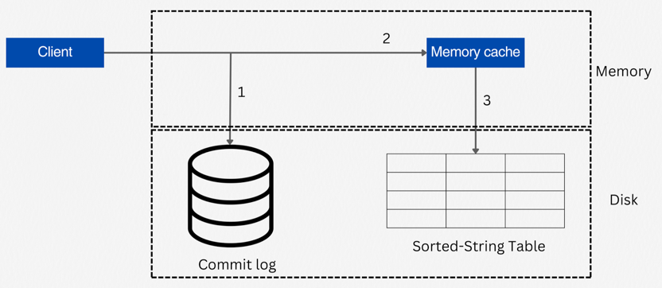
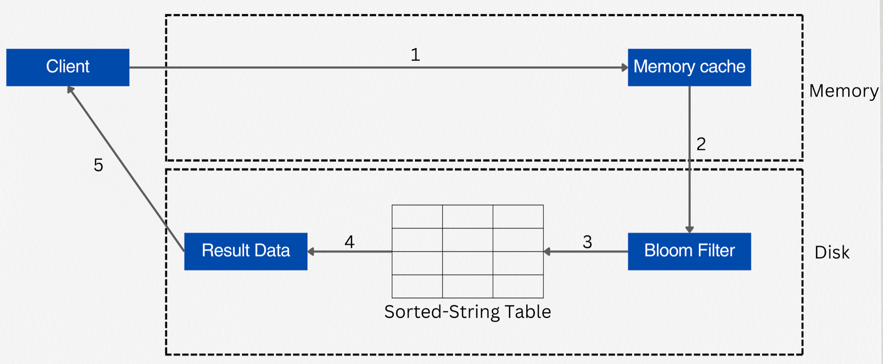

## Key-Value Store
- Key-Value Store == Key-Value Database == NoSQL

### single server key-value store
- 쉬운 유지보수
- 제한적인 용량 : 데이터 압축, 빈번하게 사용되는 데이터만 Key-Value Store에서 관리

### Distributed Key-Value Store
- CAP 이론에 따라 Consistency, Availability, Partition Tolerance 중 2개만 선택 가능
- Consistency(일관성) : 모든 노드가 동일한 데이터를 가지고 있는지
- Availability(가용성) : 모든 요청에 대해 응답을 받을 수 있는지
- Partition Tolerance(분할내구성) : 분산시스템 내의 네트워크 장애가 발생했을 때도 시스템이 동작하는지
- [분산시스템에서의 데이터 일관성과 CAP 이론](https://f-lab.kr/insight/data-consistency-and-cap-theorem-in-distributed-systems)
- [CAP 정리란?](https://www.ibm.com/kr-ko/topics/cap-theorem)
  - CA : 일관성과 가용성만 만족, 분산시스템내의 장애가 발생하면 시스템이 동작하지 않을 수도 있지만 가용성과 데이터 일관성은 만족
  - CP : 일관성과 분할내구성 만족, 모든 요청에 대해서 응답을 100% 받을 수는 없지만, 데이터의 일관성과 분산시스템내의 장애가 발생해도 데이터의 READ/WRITE 는 보장
  - AP : 가용성과 분할내구성 만족, 최신데이터를 읽을 수는 없지만,  모든 요청에 대해서 100% 응답을 받을 수 있고, 분산시스템내의 네트워크 장애가 발생해도 데이터의 READ/WRITE는 보장

### Key System Component
- Data Partition : 데이터를 여러 노드에 분산시키는 방법, 이때 데이터의 고른 분산을 위해  Consistent Hashing을 사용
- Data Replication : 고가용성을 위해 데이터의 복제본을 여러 노드(서버)에 저장하는 방법, 이때 데이터의 일관성을 위해 Replication Factor를 설정
  - 다만, 서버의 전원 공급 문제, 네트웤크이슈, 자연재해의 상황에서는 문제가 발생할 수 있다
- Data Consistency : 데이터의 일관성을 유지하기 위한 방법
  - Quorum(정족수) : 데이터의 일관성을 유지하기 위해 다수결을 이용하는 방법
    - (N) : 전체 Replica 의 개수
    - (R), Read Quorum : 데이터를 읽기 위해 필요한 노드의 수
    - (W), Write Quorum : 데이터를 쓰기 위해 필요한 노드의 수
    - 어느 것을 선택하느냐에 따라 응답지연, 데이터 일관성의 trade-off 가 발생한다.
    - Fast Read, Slow Write : R = 1, W = N
    - Slow Read, Fast Write : R = N, W = 1
    - 강한 일관성(Strong Consistency) : R + W = N , 은행/금융권
    - 약한 일관성(Weak Consistency) : R + W < N , SNS, 게임
    - 참고 URL : [분산 시스템의 내결함성을 높이는 뗏목 합의 알고리즘(Raft Consensus Algorithm)과 정족수(Quorum) 개념 알아보기](https://seongjin.me/raft-consensus-algorithm/)
- Inconsistency Resolution : 여러 Replica에 저장되는 데이터의 불일치를 해결하기 위한 방법
  - Vector Clock : 데이터의 버전을 관리하는 방법
  - Last Write Wins : 가장 최근에 쓰여진 데이터를 사용하는 방법
  - Conflict-free Replicated Data Type(CRDT) : 데이터의 충돌을 방지하는 방법
- Handling Failures
  - Broadcast : 분산 시스템 내의 모든 노드에 정보를 전송하는 방식이고, 이 방법은 특히 Key-Value Store와 같은 분산 데이터 저장 시스템에서 노드 간의 상태 정보를 공유하거나 장애를 탐지하는 데 사용. 다만, 모든 상태변화에 대해서 데이터를 전송하므로 비효율적이다.
  - Gossip Protocol : 각 노드는 주기적으로 랜덤하게 선택된 노드에게 상태정보(HeartBeat)를 전달하고, 이를 통해 전체 노드에 상태정보를 전파하는 방식. 이 때 상태정보가 오랜시간 업데이트 되지 않으면 해당 노드는 사용할 수 없는 것이라 판단. 
  - Strict Quorum : 데이터의 일관성과 가용성을 보장하기 위해 사용되는 장애 탐지 및 해결 방법, 데이터를 읽거나 쓸 때 정해진 수의 노드(Quorum)가 응답해야 작업을 성공으로 간주하는 방식
  - Sloppy Quorum : 엄격한 Quorum(정족수) 요구사항을 완화하여, 네트워크 분할(Partition)이나 노드 장애가 발생했을 때도 데이터의 가용성을 유지할 수 있도록 설계
  - Hinted Handoff : 데이터의 복제본을 저장하는 노드가 일시적으로 다운되었을 때, 해당 데이터를 임시로 다른 노드에 저장함으로써 데이터의 가용성과 내구성을 향상, 나중에 원래 노드가 다시 온라인 상태가 되면, 임시로 저장된 데이터가 원래의 위치로 다시 복제
- System Architecture Diagram
  
- WritePath
  
- ReadPath
  
  