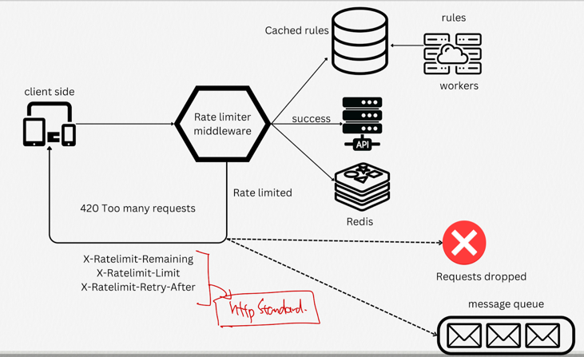

## rate-limiter 란?
- rate-limiter 는 요청이 들어왔을 때, 일정한 비율로 처리를 해주는 것을 말한다.
- rate-limiter 는 서버의 과부하를 방지하고, 서버의 안정성을 유지하기 위해 사용된다.

## 관련 알고리즘
- Token Bucket
  - Token Bucket 은 일정한 속도로 토큰을 생성하고, 토큰이 있는 경우에만 요청을 처리하는 방식이다.
  - 토큰이 없는 경우에는 요청을 거부한다.
  - 토큰이 생성되는 속도를 조절하여, 요청을 처리하는 속도를 조절할 수 있다.
- Leaky Bucket
  - 토큰생성 : 일정한 속도로 버킷에 토큰을 추가합니다. 이는 버킷(큐)에 공간이 있다는 것을 의미
  - 요청처리 : 요청(또는 패킷)이 들어올 때마다 버킷에서 토큰을 하나씩 사용하여 요청을 처리, 없으면 요청을 거부하거나 대기
  - 일정한 속도로 누수: 버킷에서는 토큰이 일정한 속도로 '누수'됩니다. 즉, 시간이 지남에 따라 토큰이 자동으로 소모되어 버킷의 용량을 일정하게 유지
  - 장점
    - 일정한 속도로 요청을 처리
    - 구현이 쉽다.
    - 메모리 효율성이 좋다(큐의 사이즈가 정해져 있다.)
  - 단점
    - 요청의 양에 비해 처리속도가 너무 늦을 경우, 새로운 요청들은 처리되지 못할 수도 있다.
- Fixed Window Counter
  - 작동방식: 요청이 들어올 때마다 카운터를 증가시키고, 일정 시간이 지나면 카운터를 초기화한다.
  - 장점
    - 구현이 쉽다.
    - 메모리 효율성이 좋다.
- Sliding Window Log
  - 작동방식 : 요청이 들어올 때마다 요청을 로그에 기록하고, 일정 시간이 지나면 로그를 삭제한다.
- Sliding Window Counter
  - Fixed Window Counter + Sliding Window Log 의 장점을 결합한 방식 

## Redis 를 이용한 Rate Limiter 구현
- Redis 는 메모리 기반의 key-value 저장소로, 빠른 속도로 데이터를 저장하고 조회할 수 있다.
- https://redis.io/glossary/rate-limiting/

### RATE LIMITING DETAIL ARCHITECTURE

## open source
- [resilience4](https://resilience4j.readme.io/docs/ratelimiter)

## 참고 
- [GN⁺: Rate Limit 알고리듬을 시각화해서 알아보기](https://news.hada.io/topic?id=14869)
- [고 처리량 분산 비율 제한기](https://engineering.linecorp.com/ko/blog/high-throughput-distributed-rate-limiter)
- [Rate Limiting](https://etloveguitar.tistory.com/126)